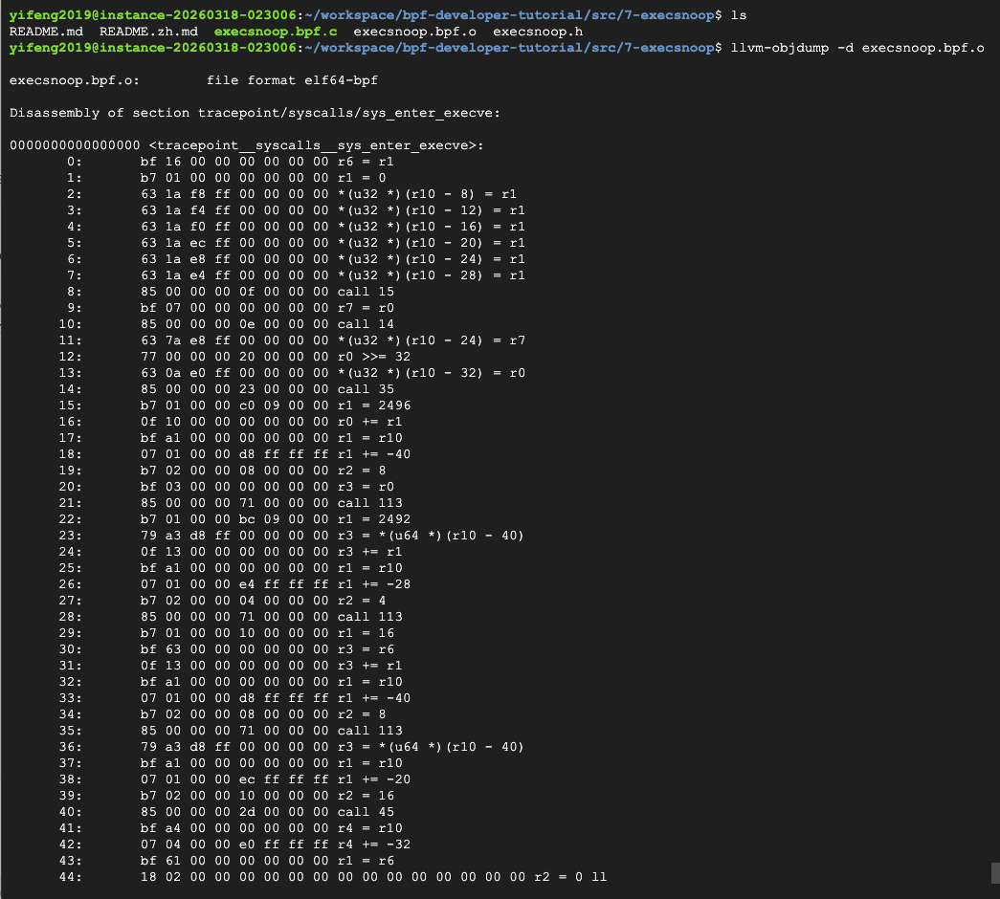

# ebpf-edr-demo

A simple EDR (Endpoint Detection and Response) pipeline using eBPF for kernel-level process monitoring.

Built as a learning project to demonstrate how eBPF works as the data collection layer in an EDR system.

---

## How It Works

```
Linux Kernel (execve syscall)
        │
        ▼
   bpftrace hook  →  JSON events
        │
        ▼
   Python agent  →  match rules  →  alerts
```

bpftrace attaches to the `execve` syscall and emits a JSON event every time a process spawns. The Python agent reads that stream, applies detection rules, and generates structured alerts.

---

## Detection Rules

| Rule | Severity |
|------|----------|
| Shell spawned from server process (nginx, apache, python3) | CRITICAL |
| Binary executed from `/tmp` | HIGH |
| Binary executed from `/dev/shm` | HIGH |

Rules and baseline suppression are configured in `rules/rules.yaml`.

---

## Usage

**Run the pipeline:**
```bash
make run
```

**Trigger a test alert:**
```bash
make test
```

**Compile the eBPF kernel C program:**
```bash
make compile
```

---

## Requirements

- Linux kernel 4.18+
- bpftrace v0.17.0+
- Python 3.8+, `pip install pyyaml`
- For compile: `clang`, `libbpf-dev`

---

## Screenshots

| | |
|---|---|
|  |  |
| Generating `vmlinux.h` from running kernel via `bpftool` | Compiled BPF bytecode (`llvm-objdump`) |
|  |  |
| `make compile` succeeds + pipeline starts | Live alerts firing in Terminal 1 while `make test` runs in Terminal 2 |

---

## Sample Output

```
[EDR Agent] Started — reading bpftrace events from stdin...
[2026-04-16 18:45:34] ALERT severity=HIGH rule=execution_from_tmp pid=2741463 parent=sh path=/tmp/test_edr_ls
```

Real output from a GCP VM (Debian 12, kernel 6.1.0-44-cloud-amd64) is in [alerts/alert.log](alerts/alert.log).

---

## Kernel Code Credit

`kernel/execsnoop.bpf.c` and `execsnoop.h` are from [eunomia-bpf/bpf-developer-tutorial](https://github.com/eunomia-bpf/bpf-developer-tutorial) (src/7-execsnoop), used here for educational purposes.
