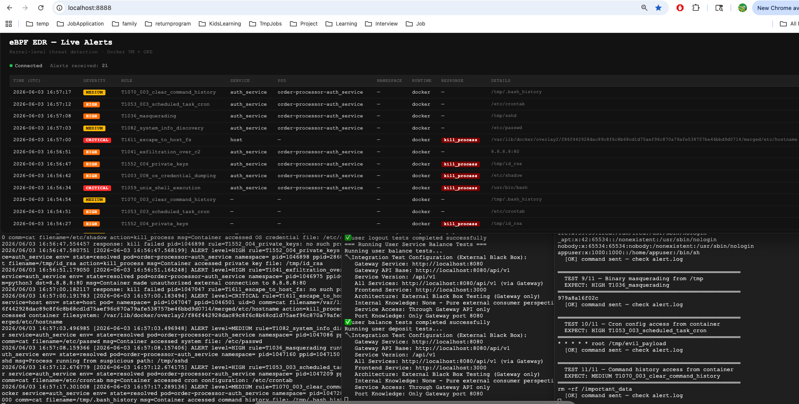

# ebpf-edr-demo

eBPF-based runtime security monitor for containerized workloads. Detects and responds to threats at the kernel level — no agent inside containers, no application changes required.

Monitors [cloud-native-order-processor](https://github.com/yifengzh/cloud-native-order-processor) — a production-style microservices platform running on Docker VM and GKE.



---

## How It Works

Three eBPF programs attach to kernel hooks and stream events via ring buffer to a Go userspace pipeline:

```
KERNEL
──────────────────────────────────────────────────────────────────────
execsnoop            opensnoop             lsm-connect
sys_enter_execve     enter+exit_openat     lsm/socket_connect
     │                     │                     │
     └─────────────────────┴─────────────────────┘
                           │  ring buffer
USERSPACE (Go)
──────────────────────────────────────────────────────────────────────
Enricher
  mnt_ns_id → WorkloadIdentity (service / pod / namespace / cluster)
                           │
Detector
  apply MITRE-mapped detection rules → Alert
                           │
Responder                                        ← response actions
  kill_process (SIGKILL)                         ← process rules
  block_ip (LPMTrie → LSM -EPERM)               ← network rules
                           │
AlertHandler
  ├── stdout + local file      (always-on)
  ├── Google Cloud Logging     (structured JSON, centralized, 365-day retention)
  └── Pub/Sub edr-alerts       (real-time stream, <1s latency)
       └── Alert Router → WebSocket → browser dashboard
```

---

## Environments

| Environment   | Host OS      | Kernel | Identity Source      | Workload              |
|---------------|--------------|--------|----------------------|-----------------------|
| Docker VM     | Debian 12    | 6.1    | Docker API           | order-processor       |
| GKE DaemonSet | Ubuntu 24.04 | 6.8    | Kubernetes + CRI     | order-processor       |

---

## Detection Rules

All rules follow MITRE ATT&CK naming. Rules marked with a response action are actively enforced — the process is killed or the IP is blocked at the kernel level.

### Process Events (execsnoop)

| Rule | MITRE | Severity | Response | Trigger |
|------|-------|----------|----------|---------|
| `T1059_unix_shell_execution` | T1059.004 · T1609 | CRITICAL | kill_process | Shell spawned inside container |
| `T1105_ingress_tool_transfer` | T1105 · T1095 | HIGH | kill_process | `nc`, `wget` executed in container |
| `T1611_escape_to_host_ns` | T1611 | CRITICAL | — | Process in unrecognized mount namespace |
| `T1036_masquerading` | T1036 | HIGH | — | Binary running from `/tmp`, `/dev/shm` |
| `T1613_container_resource_discovery` | T1613 | HIGH | — | `kubectl`, `docker` run inside container |

### File Events (opensnoop)

| Rule | MITRE | Severity | Response | Trigger |
|------|-------|----------|----------|---------|
| `T1611_escape_to_host_fs` | T1611 | CRITICAL | kill_process | Host reads container overlay filesystem |
| `T1611_escape_to_host_proc` | T1611 | HIGH | kill_process | Container reads `/proc/1/` |
| `T1552_004_private_keys` | T1552.004 | CRITICAL/HIGH | kill_process | SSH key dirs or `.key`/`id_rsa` files |
| `T1552_001_credentials_in_files` | T1552.001 | HIGH | kill_process | `.env`, `/run/secrets/` |
| `T1003_008_os_credential_dumping` | T1003.008 | HIGH | kill_process | `/etc/shadow` |
| `T1082_system_info_discovery` | T1082 | MEDIUM | — | `/etc/passwd`, `/etc/group` |
| `T1053_003_scheduled_task_cron` | T1053.003 | HIGH | — | Container touches cron config |
| `T1070_003_clear_command_history` | T1070.003 | MEDIUM | — | Container touches shell history |

### Network Events (lsm-connect)

| Rule | MITRE | Severity | Response | Trigger |
|------|-------|----------|----------|---------|
| `T1041_exfiltration_over_c2` | T1041 · T1048 | HIGH | block_ip | Unauthorized external connection |

---

## Response Actions

| Action | Mechanism | When |
|--------|-----------|------|
| `kill_process` | `syscall.SIGKILL` in Go userspace | Shell spawn, credential access, container escape |
| `block_ip` | LPMTrie BPF map → `lsm_socket_connect` returns `-EPERM` | Unauthorized external connect (blocks before TCP handshake) |

---

## Validation

11 attack simulations run against the Docker VM. All rules verified end-to-end: kernel capture → workload enrichment → response action → alert → Cloud Logging.

### Docker VM — 11/11 pass

| Test | Rule | Severity | Response |
|------|------|----------|----------|
| Shell spawn in container | `T1059_unix_shell_execution` | CRITICAL | kill_process |
| Network tool in container | `T1105_ingress_tool_transfer` | HIGH | kill_process |
| Read `/etc/shadow` | `T1003_008_os_credential_dumping` | HIGH | kill_process |
| Read SSH private key | `T1552_004_private_keys` | HIGH | kill_process |
| Unauthorized external connect | `T1041_exfiltration_over_c2` | HIGH | block_ip |
| Authorized connect (allowlisted) | — | — | no alert |
| Host reads container filesystem | `T1611_escape_to_host_fs` | CRITICAL | kill_process |
| Read `/etc/passwd` | `T1082_system_info_discovery` | MEDIUM | — |
| Binary masquerading from `/tmp` | `T1036_masquerading` | HIGH | — |
| Container touches cron config | `T1053_003_scheduled_task_cron` | HIGH | — |
| Container touches shell history | `T1070_003_clear_command_history` | MEDIUM | — |

Block verification (T5): second connect to blocked IP returns `EPERM`; private IPs remain unaffected.

---

## Centralized Alerting

Three output paths run simultaneously from every agent node:

```
Agent
  ├── stdout + local file      — always-on, no external dependency
  ├── Cloud Logging            — compliance, forensics, 365-day retention
  └── Pub/Sub edr-alerts       — real-time stream to Alert Router
       └── WebSocket → browser dashboard (<1s latency)
```

Structured alert payload:

```json
{
  "schema_version": 1,
  "ts": "2026-06-03T17:59:06.000000Z",
  "level": "HIGH",
  "rule": "T1041_exfiltration_over_c2",
  "service": "auth_service",
  "pod": "order-processor-auth_service",
  "runtime": "docker",
  "dst_ip": "8.8.8.8",
  "dst_port": 80,
  "response_action": "block_ip"
}
```

---

## How to Run

**Docker VM:**
```bash
make run-docker      # sudo env GOOGLE_CLOUD_PROJECT=ebpfagent ./ebpf-edr --runtime=docker
```

**Alert Router (Mac):**
```bash
make run-alert-router
# Open: http://localhost:8888
```

**Validation:**
```bash
sudo ./validate.sh   # Docker VM — 11 attack tests + block verification
./validate-gke.sh    # GKE attack simulation
```

**GKE DaemonSet** (from `cloud-native-order-processor/gcp_gke/`):
```bash
./deploy.sh daemonset
```

---

## Project Structure

```
cmd/edr-monitor/    — EDR agent: main entry point, pipeline wiring
cmd/alert-router/   — Alert Router: Pub/Sub subscriber, WebSocket hub, browser UI
kernel/             — eBPF C programs (execsnoop, opensnoop, lsm-connect + blocked_ips LPMTrie)
pkg/bpf/            — generated BPF loaders (bpf2go output, committed)
pkg/workload/       — WorkloadResolver: DockerResolver + K8sResolver
pkg/detector/       — MITRE-mapped detection rules, response policy, Responder
internal/alert/     — AlertHandler: local file + Cloud Logging + Pub/Sub publish
infra/              — Pulumi stack: Cloud Logging bucket, Pub/Sub topic/sub, IAM
k8s/                — GKE DaemonSet manifest
docs/               — Design docs, MITRE coverage, setup, validation guides
```

---

## Documentation

| Doc | Description |
|-----|-------------|
| [MITRE-COVERAGE.md](docs/MITRE-COVERAGE.md) | MITRE ATT&CK technique coverage — 15 techniques, all rules, response actions |
| [DETECTION-POLICY.md](docs/DETECTION-POLICY.md) | Whitelist rationale and per-environment noise policy |
| [VALIDATION.md](docs/VALIDATION.md) | Docker VM validation — 11 attack test cases |
| [VALIDATION-GKE.md](docs/VALIDATION-GKE.md) | GKE validation — attack test cases |
| [centralized-logging.md](docs/centralized-logging.md) | Cloud Logging: retention, reliability, IaC |
| [SETUP.md](docs/SETUP.md) | Environment setup, build, how to run |
| [NOTES.md](docs/NOTES.md) | Development notes, debugging reference, key technical decisions |
