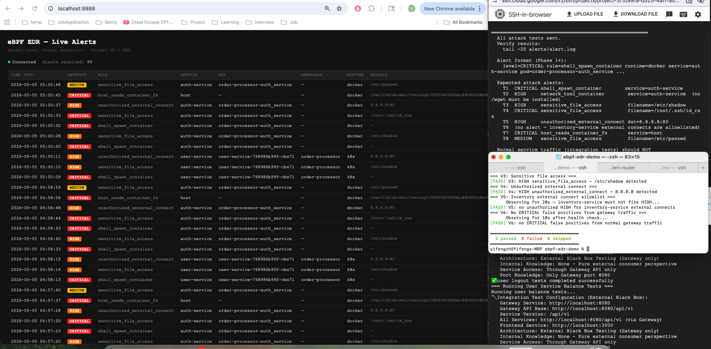

# ebpf-edr-demo

eBPF-based runtime security monitor for containerized workloads. Detects threats at the kernel level — no agent inside containers, no application changes required.

Monitors [cloud-native-order-processor](https://github.com/yifeng2019uwb/cloud-native-order-processor) — a production-style microservices platform running on Docker VM and GKE.



---

## How It Works

Three eBPF programs attach to kernel hooks and stream events via ring buffer to a Go userspace pipeline:

```
KERNEL
──────────────────────────────────────────────────────────────
execsnoop            opensnoop             lsm-connect
sys_enter_execve     enter+exit_openat     lsm/socket_connect
     │                     │                     │
     └─────────────────────┴─────────────────────┘
                           │  ring buffer
USERSPACE (Go)
──────────────────────────────────────────────────────────────
Enricher
  mnt_ns_id → WorkloadIdentity (service / pod / namespace / cluster)
                           │
Detector
  apply detection rules → Alert
                           │
AlertHandler
  ├── stdout + local file      (always-on)
  ├── Google Cloud Logging     (structured JSON, centralized, 365-day retention)
  └── Pub/Sub edr-alerts       (real-time stream, <1s latency)
       └── Alert Router → WebSocket → browser dashboard
```

Two runtimes supported from a single binary:

| Environment   | Host OS      | Kernel | Identity Source         |
|---------------|--------------|--------|-------------------------|
| Docker VM     | Debian 12    | 6.1    | Docker API              |
| GKE DaemonSet | Ubuntu 24.04 | 6.8    | Kubernetes API + CRI    |

---

## Workload Identity

Every alert carries workload context resolved from mount namespace IDs at event time — no sidecar, no instrumentation inside containers.

| Field       | Docker VM       | GKE DaemonSet                      |
|-------------|-----------------|-------------------------------------|
| `service`   | `order-service` | `order-service`                     |
| `pod`       | container name  | `order-service-768986b99f-hwv82`    |
| `namespace` | —               | `order-processor`                   |
| `runtime`   | `docker`        | `k8s`                               |
| `cluster`   | —               | `order-processor-cluster-us-west1`  |
| `region`    | —               | `us-west1`                          |

---

## Detection Rules

| Rule                            | Trigger                                    | Severity |
|---------------------------------|--------------------------------------------|----------|
| `shell_spawn_container`         | Shell (`bash`, `sh`, `zsh`) in container   | CRITICAL |
| `unknown_namespace_process`     | Process in unrecognized mount namespace    | CRITICAL |
| `host_reads_container_fs`       | Host process reads container filesystem    | CRITICAL |
| `sensitive_file_access`         | SSH keys, private keys                     | CRITICAL |
| `network_tool_container`        | `nc`, `wget` executed inside container     | HIGH     |
| `unauthorized_external_connect` | Connection to non-allowlisted external IP  | HIGH     |
| `sensitive_file_access`         | `/etc/shadow`, secret files                | HIGH     |
| `sensitive_file_access`         | `/etc/passwd`, `/etc/group`                | MEDIUM   |

---

## Validation

Attack simulations run against live deployments. All rules verified end-to-end: kernel capture → workload enrichment → alert → Cloud Logging.

### Docker VM — 8/8 pass

| Test                              | Rule                            | Result |
|-----------------------------------|---------------------------------|--------|
| shell spawn in container          | `shell_spawn_container`         | PASS   |
| network tool in container         | `network_tool_container`        | PASS   |
| read `/etc/shadow`                | `sensitive_file_access` (HIGH)  | PASS   |
| read SSH private key              | `sensitive_file_access` (CRIT)  | PASS   |
| unauthorized external connect     | `unauthorized_external_connect` | PASS   |
| authorized external connect       | (no alert — service allowlisted)| PASS   |
| host reads container filesystem   | `host_reads_container_fs`       | PASS   |
| read `/etc/passwd`                | `sensitive_file_access` (MED)   | PASS   |

### GKE DaemonSet — 5/5 pass

| Test                         | Rule                            | Result |
|------------------------------|---------------------------------|--------|
| `kubectl exec bash`          | `shell_spawn_container`         | PASS   |
| read `/etc/shadow`           | `sensitive_file_access` (HIGH)  | PASS   |
| read `/etc/passwd`           | `sensitive_file_access` (MED)   | PASS   |
| run `nc` in pod              | `network_tool_container`        | PASS   |
| connect to external IP       | `unauthorized_external_connect` | PASS   |

All GKE alerts carry full workload identity: `service`, `pod`, `namespace`, `cluster`, `region`.

---

## Centralized Alerting

Three output paths run simultaneously from every agent node:

```
Agent
  ├── stdout + local file      — always-on, no external dependency
  ├── Cloud Logging            — compliance, forensics, 365-day retention
  └── Pub/Sub edr-alerts       — real-time stream to Alert Router
       └── WebSocket → browser dashboard (<1s latency)
```

Structured alert payload written to Cloud Logging:

```json
{
  "schema_version": 1,
  "ts": "2026-05-04T16:31:42Z",
  "level": "HIGH",
  "rule": "unauthorized_external_connect",
  "cluster": "order-processor-cluster-us-west1",
  "namespace": "order-processor",
  "service": "user-service",
  "pod": "user-service-768986b99f-hwv82",
  "runtime": "k8s",
  "dst_ip": "8.8.8.8",
  "dst_port": 80
}
```

- Dual write: local file + Cloud Logging (no log loss if network unavailable)
- Cross-project: Docker VM and GKE agents both write to centralized `ebpfagent` project
- 365-day retention — infrastructure managed as code via Pulumi (`infra/`)
- Real-time UI: Alert Router (`cmd/alert-router/`) subscribes via Pub/Sub, broadcasts via WebSocket

---

## How to Run

**GKE DaemonSet** (from `cloud-native-order-processor/gcp_gke/`):
```bash
./deploy.sh daemonset
```

**Docker VM:**
```bash
make run-docker      # sudo env GOOGLE_CLOUD_PROJECT=ebpfagent ./ebpf-edr-demo --runtime=docker
```

**Alert Router (VM, port 8888):**
```bash
make run-alert-router
# SSH tunnel from laptop: ssh -L 8888:localhost:8888 <user>@<VM_IP>
# Open: http://localhost:8888
```

**Validation:**
```bash
sudo ./validate.sh   # Docker VM — 8 attack tests
./validate-gke.sh    # GKE attack simulation
```

---

## Project Structure

```
cmd/edr-monitor/    — EDR agent: main entry point, pipeline wiring
cmd/alert-router/   — Alert Router: Pub/Sub subscriber, WebSocket hub, browser UI
kernel/             — eBPF C programs (execsnoop, opensnoop, lsm-connect)
pkg/bpf/            — generated BPF loaders (bpf2go output, committed)
pkg/workload/       — WorkloadResolver: DockerResolver + K8sResolver
pkg/detector/       — detection rules and policy (allowlists, whitelists)
internal/alert/     — AlertHandler: local file + Cloud Logging + Pub/Sub publish
infra/              — Pulumi stack: Cloud Logging bucket, Pub/Sub topic/sub, IAM
k8s/                — GKE DaemonSet manifest
```

---

## Documentation

| Doc                                                             | Description                                                         |
|-----------------------------------------------------------------|---------------------------------------------------------------------|
| [SETUP.md](docs/SETUP.md)                                       | Environment setup, build, Cloud Logging VM config                   |
| [VALIDATION.md](docs/VALIDATION.md)                             | Docker VM test cases and validation procedure                       |
| [VALIDATION-GKE.md](docs/VALIDATION-GKE.md)                    | GKE validation plan and test cases                                  |
| [MITRE-COVERAGE.md](docs/MITRE-COVERAGE.md)                    | MITRE ATT&CK technique coverage                                     |
| [cnop-ebpf-monitor-design.md](docs/cnop-ebpf-monitor-design.md) | System design: monitors, detection pipeline, threat model           |
| [gke-expansion-design.md](docs/gke-expansion-design.md)         | GKE deployment design: K8sResolver, DaemonSet, workload identity    |
| [centralized-logging.md](docs/centralized-logging.md)           | Cloud Logging design: retention, reliability, IaC                   |
| [alert-router-design.md](docs/alert-router-design.md)           | Alert routing design: Pub/Sub, Alert Router, WebSocket UI           |
| [NOTES.md](docs/NOTES.md)                                       | Development notes and debugging reference                           |
